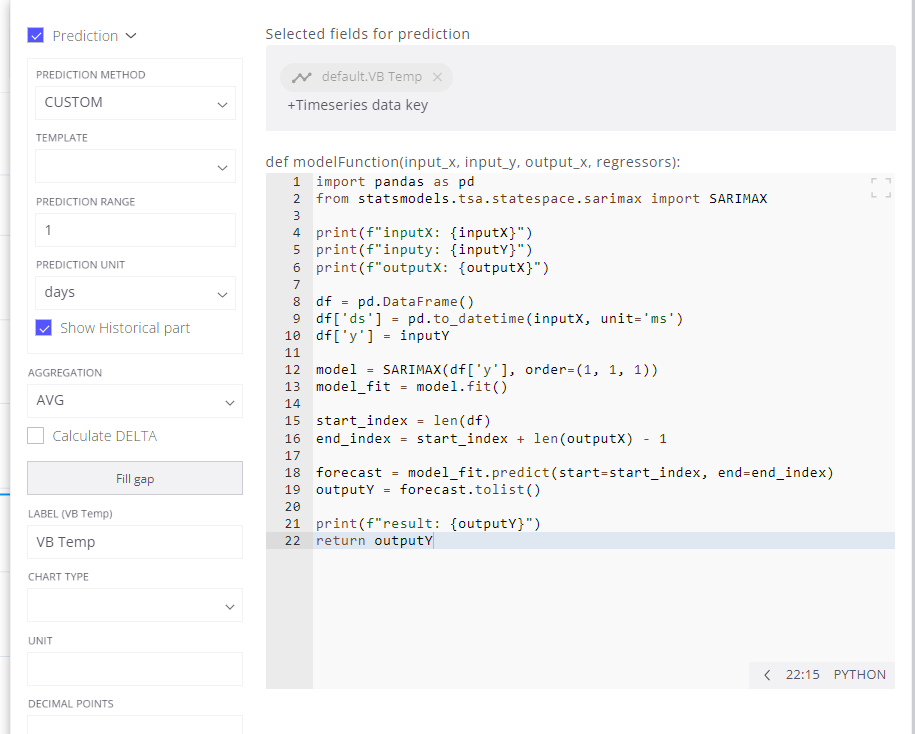

# Forecasting with Custom SARIMAX Model in Trendz Analytics

## **Overview**

This README provides a step-by-step guide on leveraging a custom SARIMAX (Seasonal Autoregressive Integrated Moving Average with Exogenous Regressors) model within the Trendz Analytics platform for data forecasting. SARIMAX is a powerful time series forecasting technique that integrates autoregressive and moving average components, along with the capability to handle exogenous variables.

## SARIMAX Model

SARIMAX extends the traditional ARIMA (Autoregressive Integrated Moving Average) model by incorporating exogenous regressors. The key components include:

- **Seasonal Component (S):** Captures periodic patterns or cycles in the data.
- **Autoregressive Component (AR):** Models the relationship between an observation and lagged observations.
- **Integrated Component (I):** Utilizes differencing to stabilize the time series.
- **Moving Average Component (MA):** Incorporates the dependence between an observation and residual errors.
- **Exogenous Regressors (X):** Allows for external variables that may influence the time series.

## **Steps**

1. **Login:**

   - The first step is to log in to Trendz Analytics using the same email and password as your ThingsBoard.cloud account.

2. **Load the Dataset:**

   - We are using a dataset from a sealing machine, which consists of the following columns: id, times, shift, status, Lower Vertical Sealing Temperature, Upper Vertical Sealing Temperature, Front/Right Horizontal Sealing Temperature, and Back/Left Horizontal Sealing Temperature.

   - Our objective is to forecast the future values of the Lower Vertical Sealing Temperature and Upper Vertical Sealing Temperature.

   - To load the dataset, you can choose to visualize the data in card, table, line, or other formats. We will choose **Line** to visualize the data in a graph and make forecasts.

3. Forecasting with Custom Model:

   - Visualize data in **Line**

     

   - Enable Custom Prediction Model. First, add the required telemetry or calculated fields into the Trendz view. Then, open the Field settings dialog and select the **CUSTOM** option in the Prediction method dropdown.

     
     
     
     
     

   - Write the Python Code. For a univariable model, write the Python code in the Model function section. Here’s an example python code for the SARIMAX model:

     ```
        import pandas as pd
        from statsmodels.tsa.statespace.sarimax import SARIMAX

        print(f"inputX: {inputX}")
        print(f"inputy: {inputY}")
        print(f"outputX: {outputX}")

        df = pd.DataFrame()
        df['ds'] = pd.to_datetime(inputX, unit='ms')
        df['y'] = inputY

        model = SARIMAX(df['y'], order=(1, 1, 1))
        model_fit = model.fit()

        start_index = len(df)
        end_index = start_index + len(outputX) - 1

        forecast = model_fit.predict(start=start_index, end=end_index)
        outputY = forecast.tolist()

        print(f"result: {outputY}")
        return outputY
     ```

     

   - Set the **Prediction Unit** to days. Specify the **Prediction Range** (e.g., 1 days for the next 1 days)

     

4. Visualize the Prediction. After writing the code, you can **BUILD** a view to see the result of your prediction model.

   

   - Lower Vertical Sealing Temperature:

     

   - Upper Vertical Sealing Temperature:

     

5. Evaluate the Forecast Model:

   - Use in-sample forecast: To evaluate the performance of the SARIMAX model, we use sample data divided into training and testing datasets. In our case, we use data from 5 days, where 4 days are used for training and 1 day for testing.
   - Manually evaluate the forecast model using Python in Google Colaboratory. The evaluation metrics we use to measure the model's performance are MAE, MSE, RMSE, and MAPE. Here are the evaluation metric results for the SARIMAX model:

     |  Temperature   | MAE | MSE | RMSE | MAPE |
     | :------------: | :-: | :-: | :--: | :--: |
     | Lower Vertical |  17.24  |  490.84  |  22.15   |  8.59   |
     | Upper Vertical |  20.92  |  667.0  |  25.83   |  10.53   |

## Conclusion

By following these steps, you can leverage the SARIMAX model in Trendz Analytics for accurate time series forecasting. For more details, refer to the [Trendz Analytics Documentation ](https://thingsboard.io/docs/trendz/).
