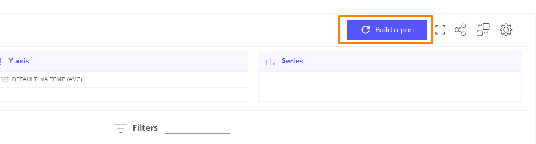

# Forecasting with Default Linear Regression Model in Trendz Analytics

## **Overview**

This README provides a step-by-step guide on utilizing a default Linear Regression model within the Trendz Analytics platform for data forecasting. Linear Regression is a fundamental statistical method used for modeling the relationship between a dependent variable and one or more independent variables.

## Linear Regression Model

Linear Regression aims to find the best-fitting straight line through the data points. The model assumes a linear relationship between the independent variables (features) and the dependent variable (target). The key components include:

- **Dependent Variable (Y):** The variable to be predicted.
- **Independent Variables (X):** The variables used to predict the dependent variable.
- **Coefficient (β):** Represents the slope of the regression line.
- **Intercept (α):** Represents the point where the regression line intersects the Y-axis.

## **Steps**

1. **Login:**

   - The first step is to log in to Trendz Analytics using the same email and password as your ThingsBoard.cloud account.

2. **Load the Dataset:**

   - We are using a dataset from a sealing machine, which consists of the following columns: id, times, shift, status, Lower Vertical Sealing Temperature, Upper Vertical Sealing Temperature, Front/Right Horizontal Sealing Temperature, and Back/Left Horizontal Sealing Temperature.

   - Our objective is to forecast the future values of the Lower Vertical Sealing Temperature and Upper Vertical Sealing Temperature.

   - To load the dataset, you can choose to visualize the data in card, table, line, or other formats. We will choose **Line** to visualize the data in a graph and make forecasts.

3. Forecasting with Default Model:

   - Visualize data in **Line**

     

   - Add the required telemetry or calculated fields into the Trendz view. Then, open the Field settings dialog and select the **LINEAR REGRESSION** option in the Prediction method dropdown.

     
     

   - Set the **Prediction Unit** to days. Specify the **Prediction Range** (e.g., 1 days for the next 1 days)

     

4. Visualize the Prediction. After writing the code, you can **BUILD** a view to see the result of your prediction model.

   

   - Lower Vertical Sealing Temperature:

     

   - Upper Vertical Sealing Temperature:

     

5. Evaluate the Forecast Model:

   - Use in-sample forecast: To evaluate the performance of the Linear Regression model, we use sample data divided into training and testing datasets. In our case, we use data from 5 days, where 4 days are used for training and 1 day for testing.
   - Manually evaluate the forecast model using Python in Google Colaboratory. The evaluation metrics we use to measure the model's performance are MAE, MSE, RMSE, and MAPE. Here are the evaluation metric results for the Linear Regression model:

     |  Temperature   | MAE | MSE | RMSE | MAPE |
     | :------------: | :-: | :-: | :--: | :--: |
     | Lower Vertical |  16.08  |  319.2  |  17.87   |  7.8   |
     | Upper Vertical |  16.0  |  306.0  |  17.49   |  7.83   |

## Conclusion

By following these steps, you can leverage the Linear Regression model in Trendz Analytics for accurate time series forecasting. For more details, refer to the [Trendz Analytics Documentation ](https://thingsboard.io/docs/trendz/).
